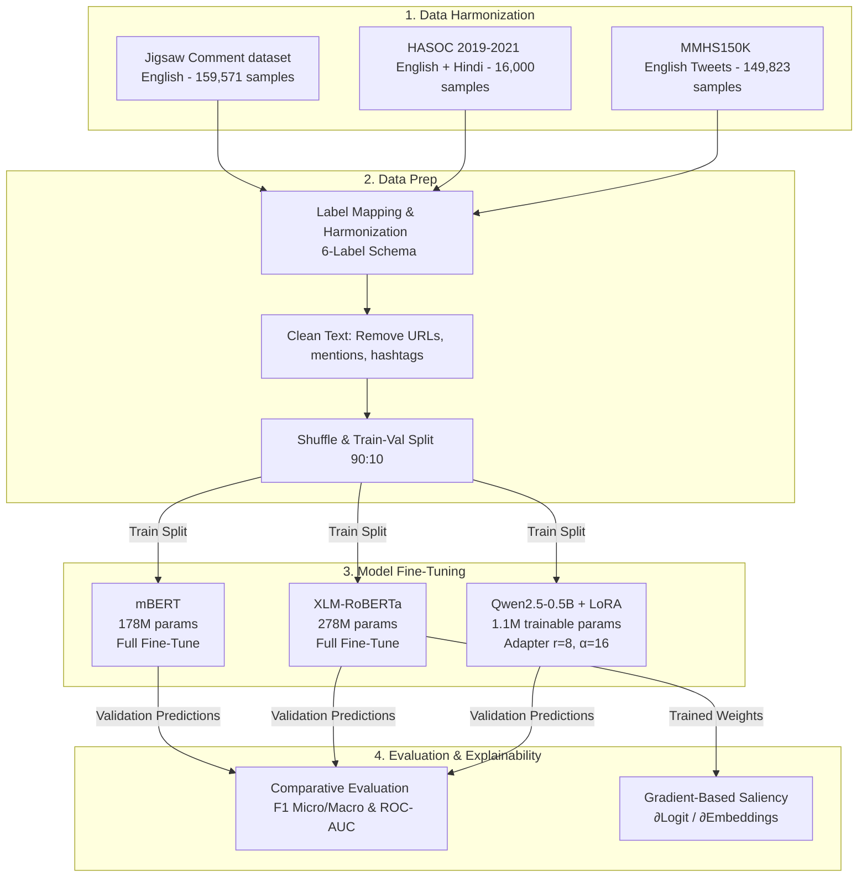

# 🛡️ Multilingual Toxicity Classification on Indian Social Media

> A comparative evaluation of **mBERT**, **XLM-RoBERTa**, and **Qwen2.5-0.5B + LoRA** on a unified English + Hinglish hate-speech corpus, featuring gradient-attribution explainability for code-mixed inputs.

---

## 📌 Project Overview
Automated content moderation is highly mature for standard English, but remains a major challenge for **Hinglish** (code-mixed Hindi-English transliterated in the Roman script). A user writing *"tu bahut stupid hai"* mixes grammar and vocabulary from two languages. Monolingual English classifiers treat these transliterated Hindi tokens as noise, while Hindi-only models fail to capture English context.

This project implements a multilingual toxicity classifier trained on a unified corpus of **354,895 examples** to detect hate speech, offensive language, and threats across English and Hindi.

---

## 🏗️ System Architecture

The following diagram illustrates the dataset harmonization, training pipeline, and evaluation framework:



---

## 📊 Benchmark Results

All models were evaluated head-to-head on the 6 standard labels: `toxic`, `obscene`, `insult`, `identity_hate`, `threat`, and `severe_toxic`.

### 1. Overall Performance Metrics
| Metric | mBERT | XLM-RoBERTa | Qwen2.5-0.5B + LoRA |
| :--- | :---: | :---: | :---: |
| **F1 Micro** | 0.7182 | 0.7270 | **0.7362** |
| **F1 Macro** | 0.6345 | **0.6525** | 0.6064 |
| **F1 Weighted** | 0.7179 | 0.7266 | **0.7353** |
| **Precision (Micro)** | 0.7374 | **0.7513** | 0.7353 |
| **Recall (Micro)** | 0.7000 | 0.7042 | **0.7371** |

### 2. Per-Label F1 Scores
| Label | Support | mBERT | XLM-RoBERTa | Qwen2.5 + LoRA |
| :--- | :---: | :---: | :---: | :---: |
| **toxic** | 12,889 | 0.7416 | 0.7525 | **0.7593** |
| **obscene** | 850 | 0.7480 | **0.7672** | 0.7544 |
| **insult** | 12,175 | 0.7325 | 0.7395 | **0.7504** |
| **identity_hate** | 9,344 | 0.6702 | 0.6763 | **0.6907** |
| **threat** | 54 | 0.4600 | **0.4854** | 0.3243 |
| **severe_toxic** | 183 | 0.4545 | **0.4940** | 0.3594 |

> [!TIP]
> **Key Finding:** Qwen2.5 + LoRA excels at common labels, giving it the highest F1 Micro. However, XLM-RoBERTa is much more robust on long-tail categories like `threat` and `severe_toxic`, making it the best model for high-stakes moderation safety margins.

---

## 🔍 Explainability: Gradient-Based Saliency Mapping

A gradient-based attribution module computes the gradient of the predicted class logit with respect to the token embeddings:

$$\text{Attribution}(t) = \sum_{d} \left| \frac{\partial \text{Logit}_{\text{toxic}}}{\partial E_{t, d}} \right|$$

Where $E_{t, d}$ is the $d$-dimensional embedding of token $t$. Scores are normalized to $[0, 1]$ and mapped back to the input words using the tokenizer's offset mapping.

### Example Attribution Outputs on Hinglish Inputs:
*   **Input:** `"tu bahut stupid hai"` (toxic)
    *   `bahut` ("very") ➔ **1.00**
    *   `stupid` ➔ **0.64**
    *   `tu` ➔ **0.82**
    *   `hai` ➔ **0.77**
*   **Input:** `"bhai tu mast kaam kar raha hai"` (benign control)
    *   Attributions stay flat in the $[0.65, 1.00]$ range, showing that no toxic-driver tokens were triggered.

## 🖥️ Web Dashboard (Interactive Showcase)

An interactive, high-fidelity Streamlit web application is included to showcase the models. It features:
- **Model Selector:** Switch dynamically between XLM-RoBERTa, mBERT, and Qwen2.5.
- **Toxicity Categorization Progress Meters:** Beautiful custom horizontal bars showing probability scores.
- **Explainability Highlighter:** Highlights toxic spans (tokens) with a red background whose opacity corresponds to their gradient attribution scores.
- **Demo Mode & Live Mode:** Runs instantly in **Demo Mode** using pre-saved validation presets (no model files or PyTorch downloads required), and lazy-loads your local/Hugging Face model weights for **Live Mode** predictions on custom inputs.

To launch the dashboard:
```bash
pip install -r requirements.txt
streamlit run app.py
```

---

## 📂 Repository Directory Structure

```
.
├── app.py                            # Streamlit dashboard showcase app
├── requirements.txt                  # Python dependencies
├── src/
│   └── predict.py                    # Inference and explainability wrapper
├── bert-base-multilingual.ipynb      # mBERT training, evaluation, & plots
├── xlm-r-merged.ipynb                # XLM-RoBERTa training, evaluation, explainability & plots
├── qwen2-5-merged.ipynb              # Qwen2.5-0.5B + LoRA training, evaluation, & plots
├── cross-model-comparison.ipynb      # Comparative F1, ROC-AUC, Heatmaps, & Radar charts
├── Project_Overview.md               # Detailed breakdown of the files & codebase
├── Toxicity_Classification_Report.pdf # Full 33-page academic project report
└── README.md                         # Project documentation
```

---

## 🚀 Quick Start Guide

### 1. Installation
Clone the repository and install the dependencies:
```bash
git clone https://github.com/Mansehaj12/Multilingual-Toxicity-Classifier-English-Hinglish.git
cd Multilingual-Toxicity-Classifier-English-Hinglish
pip install transformers datasets peft scikit-learn pandas numpy matplotlib seaborn torch openpyxl pypdf
```

### 2. Dataset Setup
Download the source datasets and place them in your input directory (or configure the paths in Cell 4 of the notebooks):
1. **Jigsaw Toxic Comment Classification** (Kaggle)
2. **HASOC 2019-2021** (Hindi/Hinglish)
3. **MMHS150K** (JSON Twitter dataset)

### 3. Execution Order
1. Run `bert-base-multilingual.ipynb` to train mBERT and export its metrics.
2. Run `xlm-r-merged.ipynb` to train XLM-R, execute the gradient attribution cells, and export metrics.
3. Run `qwen2-5-merged.ipynb` to run Qwen2.5 + LoRA parameter-efficient tuning.
4. Run `cross-model-comparison.ipynb` to read the metrics files and generate final benchmark graphs.

---

## 👤 Creator
This project was built and implemented by **Mansehaj Preet Singh** (Roll Number: 102303544) as part of the Deep Learning course at **Thapar Institute of Engineering and Technology**.

*   **Supervisor:** Kanupriya Mam, Department of Computer Science and Engineering, TIET.

---

## 📝 Citation
If this work is useful to your research, please cite this project:
```bibtex
@techreport{singh2026multilingualtoxicity,
  title       = {Multilingual Toxicity Classification: A Comparative Study of mBERT, XLM-RoBERTa, and Qwen2.5},
  author      = {Singh, Mansehaj Preet},
  institution = {Thapar Institute of Engineering and Technology},
  year        = {2026}
}
```
